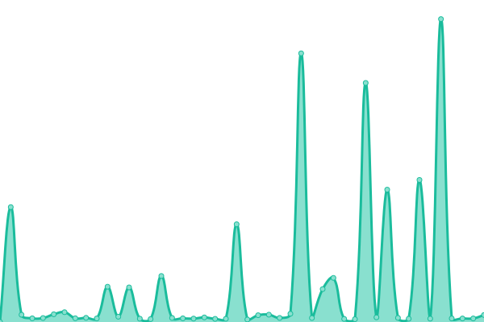

# [📈 Live Status](https://Kyo1685.github.io/supabase-monitoring): <!--live status--> **All systems operational**

This repository contains the open-source uptime monitor and status page for [Kyo1685](https://Kyo1685.github.io/supabase-monitoring), powered by [Upptime](https://github.com/upptime/upptime).

With [Upptime](https://upptime.js.org), you can get your own unlimited and free uptime monitor and status page, powered entirely by a GitHub repository. We use [Issues](https://github.com/Kyo1685/supabase-monitoring/issues) as incident reports, [Actions](https://github.com/Kyo1685/supabase-monitoring/actions) as uptime monitors, and [Pages](https://Kyo1685.github.io/supabase-monitoring) for the status page.

<!--start: status pages-->
<!-- This summary is generated by Upptime (https://github.com/upptime/upptime) -->
<!-- Do not edit this manually, your changes will be overwritten -->
<!-- prettier-ignore -->
| URL | Status | History | Response Time | Uptime |
| --- | ------ | ------- | ------------- | ------ |
|  [My Supabase Project](https://supabase.com/dashboard/project/kaphkcyzqlemozeszdyd) | 🟩 Up | [my-supabase-project.yml](https://github.com/Kyo1685/monitoring/commits/HEAD/history/my-supabase-project.yml) | 

 163ms
     
 | 

<a href="https://Kyo1685.github.io/monitoring/history/my-supabase-project">97.82%</a>
    

|  [Render](https://bot-ojfu.onrender.com) | 🟩 Up | [render.yml](https://github.com/Kyo1685/monitoring/commits/HEAD/history/render.yml) | 

 892ms
     
 | 

<a href="https://Kyo1685.github.io/monitoring/history/render">97.44%</a>
    

<!--end: status pages-->

[**Visit our status website →**](https://Kyo1685.github.io/supabase-monitoring)

## 📄 License

- Powered by: [Upptime](https://github.com/upptime/upptime)
- Code: [MIT](./LICENSE) © [Anand Chowdhary](https://anandchowdhary.com), supported by [Pabio](https://pabio.com)
- Data in the `./history` directory: [Open Database License](https://opendatacommons.org/licenses/odbl/1-0/)
